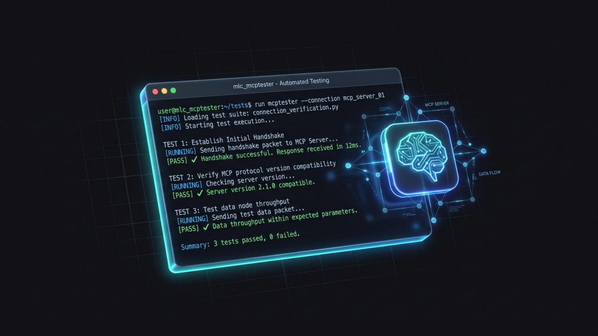
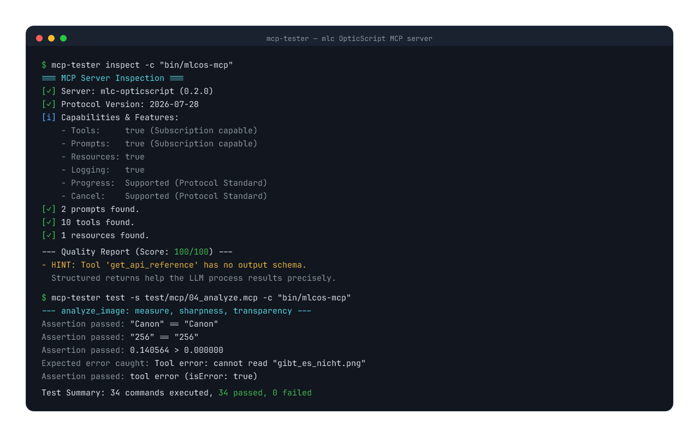

# MCP-Tester




> **[mlcgo.eu](https://mlcgo.eu)** — tools, libraries and manuals · [Product page](https://mlcgo.eu/products/mlc-tester/)


A command-line tool for testing, debugging, and validating Model Context Protocol (MCP) servers based on the latest 2026-07-28 specification.

[Deutsche Version](README.md)

## Why MCP-Tester?

Traditional unit tests (`go test`, `pytest`, `npm test`) typically invoke tool handler functions directly in-process. While this verifies business logic, it **does not test the MCP protocol contract**:

- Is the JSON-RPC communication and handshake fully compliant?
- Are arguments correctly coerced and validated against the tool's JSON schema by the transport layer?
- Are standard JSON-RPC error codes (such as `-32602` for invalid params) properly enforced?
- Do progress notifications, ping, and cancellation work across the actual transport?

Discrepancies between declared schema types and actual runtime behavior remain invisible in pure unit tests — only to fail when a real LLM or host client connects.

**`mcp-tester` closes this gap:**
- **True Client Perspective:** Tests servers as a black box over real transports (`stdio`, `sse`, `streamable-http`).
- **Declarative `.mcp` Test Scripts:** Quick, readable test scripts with variables, automatic type coercion, and assertions — zero testing boilerplate or mock harnesses.
- **Spec & Quality Validation:** Built-in `inspect` command evaluates compliance with the official MCP specification and scores best practices.
- **CI/CD Integration:** Ideal as a standard `test:integration` step in automated pipelines and Taskfiles.

## Key Features

- **Multi-Transport**: Supports local processes (`stdio`), remote servers (`sse`), and **Streamable HTTP** (`streamable-http`/`http`).
- **Full Spec Support**: Tests Tools, Resources (static & templates), Subscriptions, and Prompts according to the latest specification.
- **Pagination Support**: Supports cursors for navigating large lists (`list`).
- **Utilities**: Built-in support for Ping, Cancellation, Logging, and Progress monitoring.
- **Scripting Engine**: Automated test workflows with variables, type conversion, and assertions.
- **Server Inspector**: Analyzes servers for best practices and provides a Quality Score.
- **Raw Mode**: Bypasses SDK validation for deep-level debugging.
- **Profiles**: Easy management of different server configurations in `mcp-tester.yml`.

---

## The "Everything" Test Server

This project includes a reference server (`cmd/test-server`) that utilizes all features of the MCP protocol (Tools, Resources, Prompts, Logging, Progress, Output Schemas).

---

## Usage

### 1. Installation

**Via Go (Direct from GitHub):**
```bash
go install github.com/hmsoft0815/mlc_mcptester/cmd/mcp-tester@latest
```
*Note: Make sure `$GOPATH/bin` (usually `~/go/bin`) is in your `PATH`.*

**Getting Started:**
After installation, you can add your first server and test it immediately:
```bash
# Add a server profile
mcp-tester profile add my-server -c "npx -y @modelcontextprotocol/server-everything"

# List available tools
mcp-tester tools list -p my-server
```

**Via Curl (Linux/macOS):**
```bash
curl -sSL https://raw.githubusercontent.com/hmsoft0815/mlc_mcptester/main/scripts/install.sh | bash
```

**Manual Build:**
```bash
git clone https://github.com/hmsoft0815/mlc_mcptester.git
cd mlc_mcptester
task all            # Builds the tester and reference server into the bin/ folder
```

> **Clone without `--recursive`.** The repository points at two
> submodules (`.mlcai`, `mlcprodweb`) that live on an internal server —
> internal documentation and the product page. Neither is needed to
> build; `git clone --recursive` fails without access to that server.



*Real output: the inspector and a test run against the
[mlc OpticScript](https://mlcgo.eu/products/mlc-opticscript/) MCP server.*

### 2. Commands (Excerpt)

#### Profile Management
Manage different server configurations directly via the CLI:
```bash
mcp-tester profile add my-server -c "npx -y @modelcontextprotocol/server-everything"
mcp-tester profile list
mcp-tester profile disable my-server
mcp-tester profile delete my-server
```

#### Server Inspection
Analyze a server for quality (metadata, prompts, structure):
```bash
# Using a profile from mcp-tester.yml
mcp-tester inspect --profile local

# Direct call without a configuration file
mcp-tester inspect -c "npx -y @modelcontextprotocol/server-everything"
```

#### Tools, Resources & Prompts
```bash
mcp-tester tools list -p local
mcp-tester ping -p local
mcp-tester logging debug -p local
mcp-tester prompts get code_review --args '{"file_path": "main.go"}' -p local
```

#### Test Scripts (Automation)
Execute complex test scenarios:
```bash
./bin/mcp-tester test --script tests/03_variables_and_math.mcp --profile local -v
```

---

## Documentation

- [The MCP Handbook (Online)](https://mlcgo.eu/books/mcp-handbuch/) — A comprehensive introduction and reference to Model Context Protocol (German).
- [Scripting Reference (EN)](docs/SCRIPTING.md) — Detailed documentation of the test grammar.
- [Scripting Referenz (DE)](docs/SCRIPTING.de.md) — Detailed documentation of the test grammar (German).

---

## License

This project is licensed under the [MIT License](LICENSE).

---
*Copyright Michael Lechner - 2026-03-09*