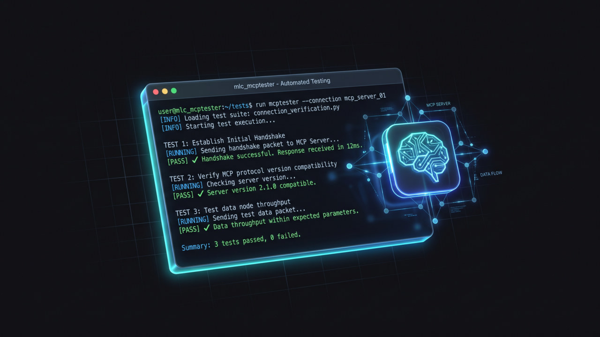
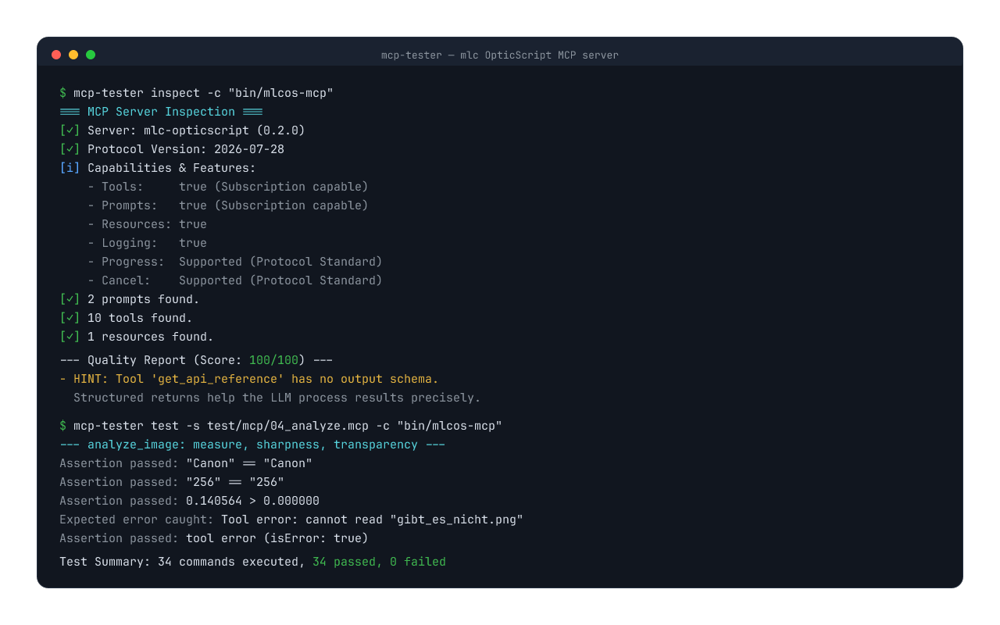

# MCP-Tester



[](docs/mcpcheck.json) reference server [`cmd/test-server`](#the-everything-test-server), checked with `task badge`

> **[mlcgo.eu](https://mlcgo.eu)** — tools, libraries and manuals · [Product page](https://mlcgo.eu/products/mlc-tester/)


A command-line tool for testing, debugging, and validating Model Context Protocol (MCP) servers based on the latest 2026-07-28 specification.

[Deutsche Version](README.md)

## Why MCP-Tester?

New hosts, harnesses and models appear almost daily, and the MCP specification keeps evolving. A server that does not follow the specification closely then "suddenly" stops working well: calls fail with stricter clients, error messages do not help the model, or the model burns tokens on retries. `mcp-tester` helps you stay current quickly and with little effort.

### Write tests instead of clicking

Classic unit tests (`go test`, `pytest`, `npm test`) call the handler function directly. They check business logic, **not the MCP protocol contract**: handshake, schema validation, error codes, structured results, progress, cancellation. That is exactly where the bugs hide that only show up when a real LLM calls the tool.

With declarative **`.mcp` test scripts** you test the server the way a client sees it: as a black box over the real transport (`stdio`, SSE, Streamable HTTP), with variables, type coercion and assertions, without boilerplate or SDK mocks. The scripts run as a gate in CI and Taskfiles (exit code, `--format json`).

```mcp
call_tool generate_image prompt:"a red flower"
set_var size $.size
assert_equals $size "512x512"

expect_error call_tool generate_image prompt:""
assert_tool_error
```

### Know early what the next spec revision requires

`mcp-tester` is regularly updated to the latest MCP specification; what it checks as of which date is recorded in the [spec coverage](docs/SPEC_COVERAGE.md). Testing your servers with it shows required changes before users or hosts trip over them, and flags **outdated features** such as an old protocol version, removed methods like `ping`, or retired error codes.

We write many MCP servers ourselves, for very different applications. That is where `mcp-tester` saves the most time: one run of the test scripts after a spec or SDK update shows which servers need changes and where the problems are.

Testing early pays off most for new features. Mistakes in **authorization** (OAuth, tokens, headers) are not just annoying, they can be dangerous and expensive. `mcp-tester` runs the full OAuth 2.1 flow and checks the Streamable HTTP transport rules with `http-check`.

### Check third-party and closed-source servers before you enable them

Even for MCP servers whose source you do not know, an analysis makes sense **before** you give them to a "real" LLM. `inspect` shows protocol version, capabilities, tools with schemas and annotations (e.g. whether a tool only reads), icons and anything unusual; `http-check` shows how cleanly the transport is implemented; `skills --verify` shows which instructions (skills) the server hands to the model, which tools they want pre-approved (`allowed-tools`) and whether the content matches the published digests.

Our own internal harness shows exactly these details before an MCP server is enabled. For users it is a very helpful basis for the decision: use it, yes or no?

### Finds bugs in SDKs, too

Because `mcp-tester` checks the server from the outside against the specification, it finds more than bugs in your own code. While adapting to spec 2026-07-28 we also found bugs and gaps in the SDK we use, for example a Base64-encoded `Mcp-Name` header that the official Go SDK v1.8.0 wrongly rejects.

## Key Features

- **True client perspective** over `stdio`, SSE and **Streamable HTTP**, with profiles in `mcp-tester.yml`.
- **Scripting engine** (`.mcp`): tools, tasks, completion, elicitation, sampling, roots and notifications are scriptable, with assertions and an exit code for CI.
- **MCP Apps**: list and check a server's interactive UIs (`apps`): tool linkage, `ui://` resources, external domains (CSP) and requested permissions such as camera or microphone – important before enabling a server.
- **Auth extensions**: client credentials (machine-to-machine) and enterprise login via ID-JAG; `auth-check` shows which flows a server offers.
- **Skills extension**: list and verify a server's skills (`skills --verify`): manifest, digests, frontmatter, naming rules. The Go package [`pkg/mcpskills`](pkg/mcpskills) serves skills from a directory.
- **Tasks extension**: start long-running tool calls as tasks, poll, cancel, supply input; `tasks` checks a server against the extension (error codes, task shape, status transitions). For server authors, the Go package [`pkg/mcptasks`](pkg/mcptasks) adds the extension to servers built on the official go-sdk.
- **Server inspector** (`inspect`): spec check, best practices and quality score; `--min-score` as a CI gate, `--badge` for a README status badge.
- **HTTP conformance** (`http-check`): required headers, error codes, Origin, sessions per spec 2026-07-28.
- **Authorization**: bearer tokens, custom headers and the OAuth 2.1 flow (PKCE, Protected Resource Metadata, `iss` validation).
- **Strict result checks**: every result is checked against the `outputSchema`, as strictly as the official TypeScript SDK.
- **Current specification**: protocol 2026-07-28 with fallback to older revisions; coverage documented with dates.
- **Raw mode** for deep debugging of non-conforming servers.

## Quick Start

1. **Install** – into your home directory, no `sudo`:
   ```bash
   curl -sSL https://raw.githubusercontent.com/hmsoft0815/mlc_mcptester/main/scripts/install.sh | bash   # to ~/.local/bin
   # or: go install github.com/hmsoft0815/mlc_mcptester/cmd/mcp-tester@latest                          # to ~/go/bin
   ```
2. **Teach your agents** – installs a skill file for Claude Code, Gemini CLI, OpenCode and Codex, each in the harness's user directory (`--dry-run` shows where first):
   ```bash
   mcp-tester agent-skill install
   ```
   Run it again after upgrading the tester; the skill always matches the installed version.
3. **Check your first server:**
   ```bash
   mcp-tester inspect -c "<command that starts your MCP server>"
   ```
4. **Read on:** [commands](#2-commands-excerpt), [test scripts](docs/SCRIPTING.md), [status badge](#status-badge-for-your-readme), [spec coverage](docs/SPEC_COVERAGE.md).

## FAQ

**`mcp-tester` reports errors – what now?**
Our recommendation is clear: test against the current specification and take the findings seriously. The output names the method, field, error code and the violated rule. Modern LLMs such as Claude or Gemini usually turn that into concrete fix suggestions quickly – just hand them the output (`--format json` works well).

**Do I have to reach a quality score of 100/100?**
No. The score is based on our own experience and assessments; a value below 100 does not automatically call for a change to the MCP server. We still think the number is very useful information, which is why it is there. How the score is made up, and what changed in the scoring in version 1.8.0, is described under [How the score is calculated](#how-the-score-is-calculated). **Protocol errors** (`inspect`) and **FAIL** (`http-check`) are different: they violate MUST rules of the specification, and real clients fail on them. Lines marked **INFO** do not count at all: they describe choices that can be legitimate, such as `ttlMs: 0` (lists immediately stale) or `cacheScope: "public"` when connected with credentials. When testing with credentials, add `--read-resources`: `inspect` then reads the first resource and warns if per-user content is marked `public`, which lets shared caches serve it to other users.

**Why is `mcp-tester` not an MCP server itself?**
Because it runs mainly in CI, where the exit code and `--format json` matter, not a tool call. Agents with shell access, such as Claude Code, OpenCode or Gemini CLI, call the CLI directly. The bundled skill file, which `mcp-tester agent-skill install` puts into each harness, tells them how: which command is for what, how to write `.mcp` scripts and what to watch for in CI. Usually a single server is under test anyway, so an extra server adds nothing. Then there is security: a tool that starts arbitrary processes and calls URLs would be a wide-open door, while the CLI runs only with the rights you give it. A server mode would still help hosts without a shell; the idea is noted but not planned yet.

---

## The "Everything" Test Server

This project includes a reference server (`cmd/test-server`) that demonstrates the MCP protocol: tools with output schemas, resources and templates, prompts, completion, logging, progress, elicitation, sampling, roots, notifications via `subscriptions/listen`, `x-mcp-header`, URL-mode elicitation, tool annotations, `instructions`, cache hints and pagination (five entries per page). `task test-inspect` requires 100/100 for it. With `-addr :8080` it runs over HTTP, with `-auth` additionally OAuth-protected by a built-in test authorization server.

So the tester is not checked against the go-sdk alone, a second, smaller reference server on the TypeScript SDK v2 lives in `tests/interop/ts-server`, an independent implementation of 2026-07-28. `task test-interop-ts-server` requires the same verdicts for it as for the Go server, over stdio and HTTP: 100/100 in `inspect`, no FAIL in `http-check`, a passing script (needs Node 20+).

---

## Usage

### 1. Installation

**Via Go (Direct from GitHub):**
```bash
go install github.com/hmsoft0815/mlc_mcptester/cmd/mcp-tester@latest
```
*Note: Make sure `$GOPATH/bin` (usually `~/go/bin`) is in your `PATH`.*

**Getting Started:**
After installation, you can add your first server and test it immediately:
```bash
# Add a server profile
mcp-tester profile add my-server -c "npx -y @modelcontextprotocol/server-everything"

# List available tools
mcp-tester list -p my-server
```

**Via Curl (Linux/macOS)** – installs to `~/.local/bin` (other target: `INSTALL_DIR=…`):
```bash
curl -sSL https://raw.githubusercontent.com/hmsoft0815/mlc_mcptester/main/scripts/install.sh | bash
```

**Manual Build:**
```bash
git clone https://github.com/hmsoft0815/mlc_mcptester.git
cd mlc_mcptester
task all            # Builds the tester and reference server into the bin/ folder
```

> **Clone without `--recursive`.** The repository points at two
> submodules (`.mlcai`, `mlcprodweb`) that live on an internal server —
> internal documentation and the product page. Neither is needed to
> build; `git clone --recursive` fails without access to that server.



*Real output: the inspector and a test run against the
[mlc OpticScript](https://mlcgo.eu/products/mlc-opticscript/) MCP server.*

### 2. Commands (Excerpt)

#### Profile Management
Manage different server configurations directly via the CLI:
```bash
mcp-tester profile add my-server -c "npx -y @modelcontextprotocol/server-everything"
mcp-tester profile list
mcp-tester profile disable my-server
mcp-tester profile delete my-server
```

#### Protected servers (authorization)
For HTTP transports. Static credentials via flags or profile, otherwise the spec's OAuth 2.1 flow (PKCE, Protected Resource Metadata, `iss` validation; client registration via Client ID Metadata Document, pre-registered client or dynamic):
```bash
# Bearer token or any header
mcp-tester list -u https://example.com/mcp --bearer "$TOKEN"
mcp-tester list -u https://example.com/mcp -H "X-Api-Key: $KEY"

# OAuth: the URL is printed (or opened with --oauth-browser)
mcp-tester inspect -u https://example.com/mcp --oauth
mcp-tester inspect -u https://example.com/mcp --oauth --oauth-client-id my-client

# Without a browser, for authorization servers without user interaction (CI, test-server -auth)
mcp-tester inspect -u http://127.0.0.1:8080/mcp --oauth --oauth-auto

# Auth extensions: machine-to-machine and enterprise login (ID token → ID-JAG)
mcp-tester list -u https://example.com/mcp --oauth-client-credentials --oauth-client-id svc --oauth-client-secret "$SECRET"
mcp-tester list -u https://example.com/mcp --oauth-enterprise --idp-issuer https://idp.example --idp-client-id app \
  --id-token "$ID_TOKEN" --oauth-client-id app

# Which flows does the server offer, and is the metadata right?
mcp-tester auth-check -u https://example.com/mcp
```
In a profile: `headers:` and `bearer:`, `${VAR}` is expanded from the environment. `./bin/test-server -addr :8080 -auth` starts a protected test server with a built-in authorization server (static tokens `test-token` and, as a second user, `test-token-2`).

#### HTTP conformance (`http-check`)
Checks a Streamable HTTP endpoint with hand-built requests against the transport rules of spec 2026-07-28: required headers (`MCP-Protocol-Version`, `Mcp-Method`, `Mcp-Name`, Base64 values, `Mcp-Param-*` from `x-mcp-header`), error codes with HTTP status (`-32020`, `-32022`, 404/`-32601`), Origin validation (403), 405 for GET/DELETE and no sessions. MUST violations: FAIL and exit 1, SHOULD violations: WARN.
```bash
mcp-tester http-check -u https://example.com/mcp --bearer "$TOKEN"
mcp-tester http-check -u http://127.0.0.1:8080/mcp --format json
```

#### Server Inspection
Analyze a server for quality (metadata, prompts, structure):
```bash
# Using a profile from mcp-tester.yml
mcp-tester inspect --profile local

# Direct call without a configuration file
mcp-tester inspect -c "npx -y @modelcontextprotocol/server-everything"

# As a CI gate: exit 1 on protocol errors or a score below the threshold
mcp-tester inspect -p local --min-score 90

# Tools that return plain text (Markdown, source code) on purpose: no output schema expected
mcp-tester inspect -p local --text-only render_markdown,get_source
```
`inspect` sums up tools without an output schema in one HINT line (`--hints-per-tool` for one line per tool). If a tool returns plain text on purpose, `--text-only` exempts it: no hint, no deduction; an INFO line and the JSON field `textOnlyTools` name the exempted tools. In a profile, the same list goes under `text_only: [render_markdown, get_source]`.

#### How the score is calculated

Every server starts at 100 points. Two kinds of deductions are subtracted:

- **Quality deductions**: missing descriptions, titles, output schemas or prompts, naming rules, icons, an outdated protocol revision and the like. Each category is capped, so a server with many tools is not punished for the same mistake without bound.
- **Violations of MUST rules of the spec**: failed `*/list` calls, an `inputSchema` not of type `object`, missing cache fields, invalid `x-mcp-header`, violations of the Skills or the Tasks extension.

Tools with `readOnlyHint` earn a bonus of up to 20 points. It offsets **quality deductions only**. The score is then capped at 100, and only after that are MUST violations deducted.

> **Scoring changed in version 1.8.0**
>
> Up to and including 1.7.0 the bonus was applied against all deductions before the cap. A server with many `readOnlyHint` tools could thus hide MUST violations completely and still reach 100/100. Now every MUST violation costs points visibly. The error codes of the Tasks extension are newly checked as well, including `-32021` for `subscriptions/listen` without the extension. Servers built on the go-sdk that declare the Tasks extension violate this rule unless they add code for it, and now lose 10 points. [`pkg/mcptasks`](pkg/mcptasks) fixes this with `GuardListen` or `GuardListenHandler`.
>
> **What to do:** run `inspect` once with the new version. If the score drops, the output names the cause as a WARNING. If you use `--min-score` as a CI gate, check before updating that the threshold is still met; fix the cause or lower the threshold for a while. Badges showing the score change on the next run.

#### Checking the Tasks extension (`tasks`)

For servers with the Tasks extension, `inspect` checks only the error codes and calls no tool. `tasks` goes further:

```bash
# Error codes of tasks/get, tasks/update, tasks/cancel and subscriptions/listen, no tool call
mcp-tester tasks -p local

# Follow one task to its end: handle, durable creation, every tasks/get result,
# status transitions, input requests and, if offered, notifications/tasks
mcp-tester tasks -p local --tool long_job --args '{"seconds":2}' --elicit 'accept:{"name":"Ada"}'

# Cancel right after the start
mcp-tester tasks -p local --tool long_job --args '{"seconds":30}' --cancel

# Over HTTP with credentials: a second identity must not reach the task
mcp-tester tasks -u https://example.com/mcp --bearer "$TOKEN_A" --other-bearer "$TOKEN_B" --tool long_job
```

`task test-interop-ts` also runs the extension's official TypeScript client (`@modelcontextprotocol/ext-tasks`) against our reference server, over stdio and Streamable HTTP (needs Node 20+). This checks `pkg/mcptasks`, and with it the tester's assumptions, against an independent implementation of the spec.

With `--tool` the tool runs **twice**, once without and once with the extension, so pick one that is safe to run more than once. MUST violations give FAIL and exit 1. For server authors, [`pkg/mcptasks`](pkg/mcptasks) adds the extension to go-sdk servers, including binding tasks to the identity that created them.

#### Status badge for your README

On request, `inspect` writes a badge that other projects can embed in their README:


```bash
mcp-tester inspect -p local --badge docs/mcpcheck.svg --badge-json docs/mcpcheck.json
```

```md
[](docs/mcpcheck.json)
```

- **spec 2026-07-28**: the protocol revision the server negotiated. This is deliberately not the test date, because the revision shows whether the server is up to date.
- **100/100**: the `inspect` quality score. With `--badge-no-score`, only the revision appears.
- **Colour**: green; yellow for a score below 80 or an older revision; red ("failing") on protocol errors, whatever the score.
- The test date and the tester version appear in the SVG tooltip and in the JSON file. Link the badge to the JSON so readers can see when and with what the server was checked.
- The badge is written even when the check fails (red), so a stale green badge does not stay behind. The SVG is self-contained and needs no external service. The JSON follows the [shields.io endpoint schema](https://shields.io/badges/endpoint-badge), so it also works with `https://img.shields.io/endpoint?url=<raw URL of the JSON>`.

#### Tools, Resources & Prompts
```bash
mcp-tester list -p local
mcp-tester list -p local --format json   # all tools with schemas as JSON (likewise resources list/templates, prompts list)
mcp-tester ping -p local
mcp-tester logging debug -p local
mcp-tester prompts get code_review --args '{"file_path": "main.go"}' -p local
mcp-tester complete prompt:code_review file_path ma -p local
```

#### Test Scripts (Automation)
Execute complex test scenarios:
```bash
./bin/mcp-tester test --script tests/03_variables_and_math.mcp --profile local -v
```

---

## Documentation

- [The MCP Handbook (Online)](https://mlcgo.eu/books/mcp-handbuch/) — A comprehensive introduction and reference to Model Context Protocol (German).
- [Scripting Reference (EN)](docs/SCRIPTING.md) — Detailed documentation of the test grammar.
- [Scripting Referenz (DE)](docs/SCRIPTING.de.md) — Detailed documentation of the test grammar (German).
- [Agent skill](internal/agentskill/SKILL.md) — Compact guide for AI agents; install with `mcp-tester agent-skill install`.
- [Changelog](CHANGELOG.md) — Changes per version (Added/Changed/Fixed).
- [Spec Coverage (EN)](docs/SPEC_COVERAGE.md) — Which features of the current MCP specification are checked, with date.

---

## License

This project is licensed under the [MIT License](LICENSE).

---
*Copyright Michael Lechner - 2026-03-09*

<!-- mlcai-private -->
## Project documentation (`.mlcai/`)

`.mlcai/` is a **private git submodule**: internal planning, backlog and work notes, maintained with the MLC Doc Hub. It is not publicly accessible — clone **without** `--recurse-submodules`; the build does not need it. Links into `.mlcai/` only work with access (`git submodule update --init .mlcai`).
