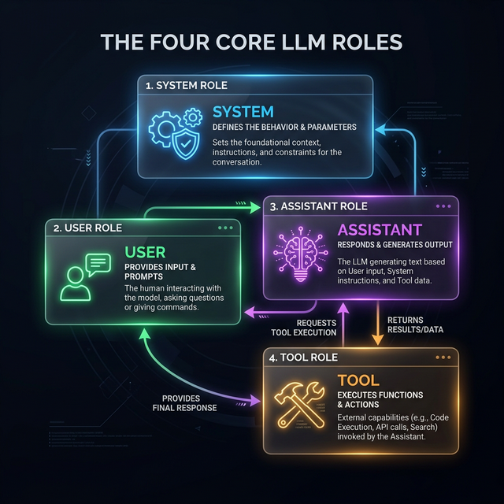
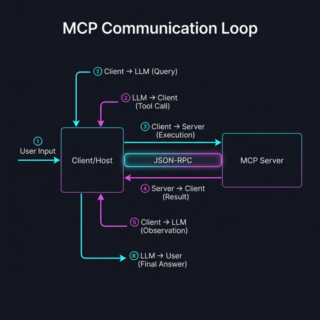

# Kapitel 2: Wie LLMs kommunizieren

Bevor wir in den Code eintauchen, müssen wir verstehen, wie eine Unterhaltung mit einem LLM technisch aussieht. Ein LLM "denkt" nicht wie ein Mensch in Echtzeit, sondern verarbeitet eine Sequenz von Nachrichten.

## Die drei klassischen Rollen


Jede moderne Interaktion mit einem Modell (wie GPT-4 oder andere SOTA-Modelle) besteht aus einer Liste von Nachrichten, die jeweils einer Rolle zugeordnet sind:

1.  **System-Nachricht (System Prompt)**:
    Dies ist die "Betriebsanweisung" für das Modell. Hier wird die Identität festgelegt: *"Du bist ein hilfreicher Assistent für Datenanalyse. Antworte immer kurz und bündig."* Hier werden auch Regeln und Einschränkungen definiert.
2.  **Benutzer-Nachricht (User)**:
    Das ist die Eingabe des Menschen. Die Frage oder die Aufgabe: *"Wie hoch ist die CPU-Last?"*
3.  **Assistent-Nachricht (Assistant)**:
    Die Antwort des Modells. Sie baut auf dem System-Prompt und allen bisherigen User-Nachrichten auf. Ein Assistent kann entweder Text antworten **oder** einen Tool-Call (Werkzeugaufruf) anfordern.

## Die vierte Rolle: Das Werkzeug (Tool)

Hier kommt MCP ins Spiel. Um den Loop zu schließen, wurde eine entscheidende vierte Rolle eingeführt:



4.  **Tool-Ergebnis (Tool)**:
    Dies ist die "Antwort" des MCP-Servers an das Modell. Wenn der Assistent ein Tool aufruft, führt der Client dieses aus und sendet das Ergebnis mit der Rolle `tool` zurück in den Chat-Verlauf. Ohne diese vierte Rolle wüsste das Modell nie, was bei seinem Aufruf herausgekommen ist.


## Wie kommen die Tools ins Modell? (Tool Injection)

Ein LLM weiß von Natur aus nichts über deine MCP-Tools. Der Client (z. B. Claude Desktop oder unser `mcp-tester`) muss dem Modell erst sagen, dass diese Tools existieren.

Dieser Prozess nennt sich **Injection**. Bevor die eigentliche User-Frage an das LLM gesendet wird, fügt der Client eine versteckte Liste von Beschreibungen hinzu. Das sieht vereinfacht so aus:

> **System**: Du bist ein Assistent.
> **Verfügbare Tools**:
> - `get_cpu_usage`: Liefert die aktuelle CPU-Last. Parameter: keine.
> - `add`: Addiert zwei Zahlen. Parameter: `a` (int), `b` (int).
>
> **User**: Wie hoch ist die CPU-Last?

## So sieht die Anfrage an das LLM aus (JSON)

Wenn ein Client (wie unser Tester) eine Anfrage an ein Modell sendet, sieht der JSON-Body für eine API (z. B. OpenAI oder Anthropic) in etwa so aus. Beachte, wie die MCP-Tool-Definitionen hier "injiziert" werden:

```json
{
  "model": "gpt-4",
  "messages": [
    { "role": "system", "content": "Du bist ein hilfreicher Assistent." },
    { "role": "user", "content": "Wie viel ist 10 + 20?" }
  ],
  "tools": [
    {
      "type": "function",
      "function": {
        "name": "add",
        "description": "Addiert zwei Zahlen",
        "parameters": {
          "type": "object",
          "properties": {
            "a": { "type": "integer" },
            "b": { "type": "integer" }
          },
          "required": ["a", "b"]
        }
      }
    }
  ]
}
```

## Die Antwort des Modells (Tool Call)

Wenn das Modell erkennt, dass es ein Tool braucht, antwortet es nicht mit Text, sondern mit einem Aufruf-Befehl:

```json
{
  "role": "assistant",
  "tool_calls": [
    {
      "id": "call_abc123",
      "type": "function",
      "function": {
        "name": "add",
        "arguments": "{\"a\": 10, \"b\": 20}"
      }
    }
  ]
}
```

An diesem Punkt stoppt das LLM. Es ist nun die Aufgabe des **MCP-Clients**, diesen Aufruf zu nehmen, an den **MCP-Server** weiterzuleiten und das Ergebnis wieder in den Chat-Verlauf einzufügen.

## Das Ergebnis zurück an das LLM senden

Nachdem der Client die Antwort vom MCP-Server erhalten hat, sendet er eine **neue Anfrage** an das LLM. Diese enthält nun den gesamten bisherigen Verlauf PLUS das Ergebnis des Tool-Aufrufs:

```json
{
  "model": "gpt-4",
  "messages": [
    { "role": "system", "content": "Du bist ein hilfreicher Assistent." },
    { "role": "user", "content": "Wie viel ist 10 + 20?" },
    {
      "role": "assistant",
      "tool_calls": [
        {
          "id": "call_abc123",
          "type": "function",
          "function": { "name": "add", "arguments": "{\"a\": 10, \"b\": 20}" }
        }
      ]
    },
    {
      "role": "tool",
      "tool_call_id": "call_abc123",
      "content": "Ergebnis: 30"
    }
  ]
}
```

Erst jetzt hat das Modell alle Informationen, um die finale Antwort für den Benutzer zu formulieren.

## Tools und Instruktionen (Hand-in-Hand)

Wichtig für das Verständnis: Die reine Injektion der Tool-Definition reicht oft nicht aus. Ein guter Client oder ein MCP-Prompt (siehe Kapitel 6) ergänzt den **System-Prompt** oft um explizite Verhaltensregeln für diese Tools:

*   *"Nutze das Tool `add` immer, wenn der Benutzer eine mathematische Frage stellt."*
*   *"Frage erst nach Erlaubnis, bevor du das Tool `delete_file` aufrufst."*

Diese Kombination aus **Fähigkeit (Tool)** und **Anweisung (Prompt)** macht MCP-Server so extrem präzise und sicher in der Anwendung.

## Der Tool-Call-Loop
...

1.  **Modell -> Client**: "Ich möchte `get_cpu_usage` aufrufen." (Das Modell stoppt die Textgenerierung hier).
2.  **Client -> MCP-Server**: Der Client führt die Funktion auf dem Server aus.
3.  **MCP-Server -> Client**: Der Server liefert das Ergebnis (z. B. `15%`).
4.  **Client -> Modell**: Der Client sendet eine neue Nachricht mit der Rolle **Tool** zurück an das Modell: *"Ergebnis von `get_cpu_usage` ist `15%`"*.
5.  **Modell -> User**: Jetzt erst generiert das Modell den finalen Text: *"Die CPU-Last liegt aktuell bei 15%."*

MCP standardisiert genau diesen Austausch zwischen Client und Server, damit der Loop für jedes Tool und jedes Modell gleich funktioniert.


[← Inhaltsverzeichnis](README.md) | [Nächstes Kapitel: Minimal MCP →](03_minimal_mcp_stdio.md)

---
*Copyright Michael Lechner - 2026-02-28*
