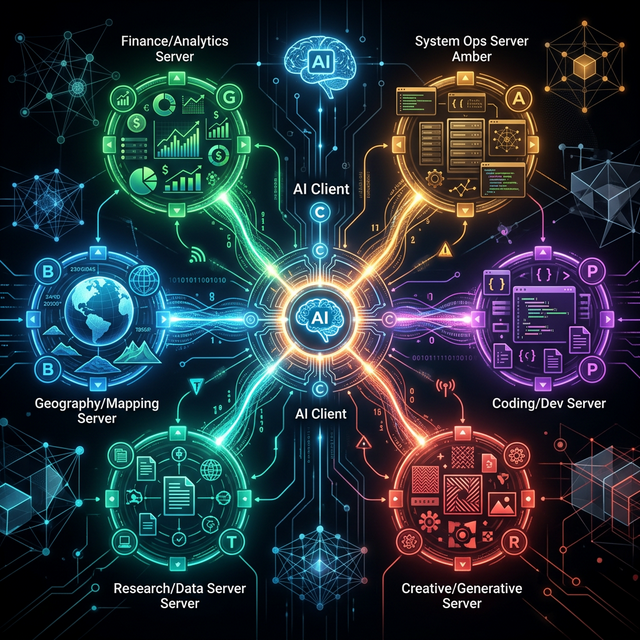

# Kapitel 7: Die Macht der Kombination – Multi-Server Orchestrierung

Die wahre Revolution von MCP liegt nicht in der Anbindung eines einzelnen Servers, sondern in der **Kombination vieler spezialisierter Server**. In diesem Kapitel zeigen wir an einem detaillierten Beispiel, wie der Client Anweisungen von verschiedenen Quellen sammelt und das LLM durch einen komplexen Workflow führt.



## Das Szenario: Der globale Support-Assistent

Wir nutzen zwei MCP-Server gleichzeitig:
1.  **Server A (Kunden-DB)**: 
    *   Tool: `get_customer_data(id)`
    *   Prompt: `customer_support_persona` (Anweisung: "Gehe immer respektvoll mit Kundendaten um.")
2.  **Server B (Translator)**: 
    *   Tool: `translate(text, target_lang)`
    *   Prompt: `professional_translator` (Anweisung: "Nutze förmliches Deutsch (Sie).")

**User-Anfrage:** *"Hol mir die Infos zu Kunde 123 und übersetze seine Biografie ins Deutsche."*

---

## Phase 1: Aufbau des kombinierten System-Kontexts

Bevor das LLM die erste Nachricht sieht, ruft der Client die Prompts von **beiden** Servern ab und verschmilzt sie zu einem einzigen, mächtigen System-Prompt.

### JSON: Der Client baut die Anfrage (Turn 1)
```json
{
  "model": "gpt-4",
  "messages": [
    { 
      "role": "system", 
      "content": "Kombinierte Anweisungen:\n1. [Vom Kunden-DB Server]: Gehe immer respektvoll mit Kundendaten um.\n2. [Vom Translator Server]: Nutze förmliches Deutsch (Sie)." 
    },
    { "role": "user", "content": "Infos zu Kunde 123 holen und Biografie ins Deutsche übersetzen." }
  ],
  "tools": [ 
    { "name": "get_customer_data", "description": "Liest Kundendaten..." },
    { "name": "translate", "description": "Übersetzt Text..." }
  ]
}
```

---

## Phase 2: Der Multi-Step Loop (Die Ausführung)

### Turn 2: Das LLM entscheidet sich für das erste Werkzeug
Das LLM erkennt: "Ich brauche erst die Daten, bevor ich übersetzen kann."

```json
{
  "role": "assistant",
  "tool_calls": [
    { "id": "call_1", "function": { "name": "get_customer_data", "args": "{\"id\": \"123\"}" } }
  ]
}
```

### Turn 3: Der Client liefert das Ergebnis und fragt erneut
Der Client hat `get_customer_data` auf Server A ausgeführt. Die Biografie ist auf Englisch.

```json
{
  "messages": [
    "...",
    { "role": "tool", "tool_call_id": "call_1", "content": "{\"name\": \"John\", \"bio\": \"Living in NY, loving jazz.\"}" },
    { "role": "user", "content": "..." }
  ]
}
```

### Turn 4: Das LLM nutzt das zweite Werkzeug (Orchestrierung)
Das LLM nimmt den englischen Text aus Schritt 3 und sendet ihn an Server B. Beachte: Das LLM "erinnert" sich an die Translator-Anweisung ("Nutze 'Sie'"), die ursprünglich von Server B kam!

```json
{
  "role": "assistant",
  "tool_calls": [
    { "id": "call_2", "function": { "name": "translate", "args": "{\"text\": \"Living in NY, loving jazz.\", \"target_lang\": \"de\"}" } }
  ]
}
```

---

## Phase 3: Die finale Antwort

Nachdem Server B die Übersetzung geliefert hat (`"Wohnt in NY, liebt Jazz."`), formuliert das LLM die Antwort unter Berücksichtigung **aller** Anweisungen:

**Assistent:** *"Hier sind die Informationen zu Kunden 123 (John): Er wohnt in New York und liebt Jazz."*

---

## Warum das so mächtig ist

1.  **Wissensteilung**: Server A weiß alles über Kunden, Server B alles über Sprachen. Keiner weiß vom anderen, aber der **Client + LLM** bringen sie zusammen.
2.  **Zentralisierte Logik**: Die Anweisung, "Sie" zu verwenden, steht nur einmal im Translator-Server. Jeder Client, der diesen Server einbindet, übernimmt automatisch diese Qualität.
3.  **Dynamische Intelligenz**: Wenn du morgen einen "Compliance-Server" hinzufügst, der eine Anweisung für DSGVO einbringt, wird das LLM sofort anfangen, diese Regeln bei allen Kunden-Abfragen anzuwenden – ohne dass du den Code der anderen Server ändern musst.

**MCP macht KI modular.** Es erlaubt uns, komplexe Verhaltensweisen aus kleinen, wohldefinierten Bausteinen (Servern) zusammenzusetzen. Unser `mcp-tester` ist das Werkzeug, mit dem du jeden dieser Bausteine einzeln prüfst, damit das Gesamtkunstwerk am Ende perfekt funktioniert.


[← Inhaltsverzeichnis](README.md) | [Nächstes Kapitel: Tool-Falle →](08_zu_viele_tools_probleme.md)

---
*Copyright Michael Lechner - 2026-02-28*
