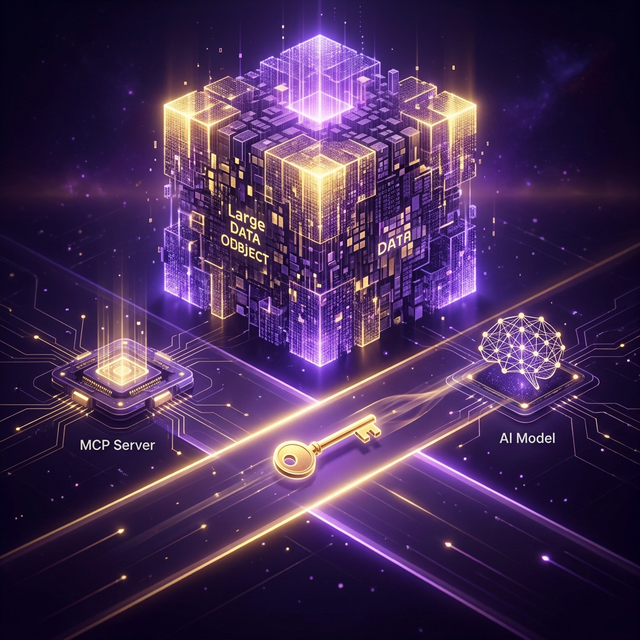

# Kapitel 13: Das Artifact-Pattern – Brücke zwischen Modell-Limits und Benutzererlebnis

In Kapitel 12 haben wir über die Grenzen von LLMs gesprochen: Fehlende Multimodalität und die Gefahr, den Kontext durch zu große Datenmengen zu sprengen. In diesem Kapitel lernen wir eine elegante architektonische Lösung kennen: Das **Artifact-Pattern**.

## Das Problem der "schweren" Daten

Wenn ein MCP-Server ein 10 MB großes PDF, ein hochauflösendes Bild oder eine komplexe Word-Datei verarbeitet, gibt es zwei Hürden:
1.  **Das Modell**: Es kann die Datei eventuell gar nicht lesen (Binary).
2.  **Der Kontext**: Die Datei würde das Gedächtnis des Modells sofort überfüllen.

## Die Lösung: Referenz statt Inhalt

Anstatt die gesamte Datei in den Chat-Verlauf zu injizieren, nutzt der Server einen **Artifact-Speicher** (wie den `mlcartifact` Server). Der Ablauf ändert sich grundlegend:

1.  **Aktion**: Das LLM ruft ein Tool auf (z. B. `generate_report`).
2.  **Speicherung**: Der MCP-Server generiert das PDF und speichert es als **Artifact**.
3.  **Antwort**: Der Server gibt dem LLM nur eine kurze Text-Info zurück: 
    > *"Bericht generiert und als Artefakt mit der ID `REPORT-2026-01` verfügbar."*
4.  **Information**: Das LLM teilt dem Benutzer mit: *"Ich habe den Bericht erstellt. Er liegt als Artefakt REPORT-2026-01 für dich bereit."*

---

## Die Rolle des intelligenten Clients

Die wahre Magie passiert auf der Client-Seite (dem UI). Ein moderner Chat-Client sieht die ID in der Antwort des Modells und kann:
*   Das Artefakt im Hintergrund vom Artifact-Server laden.
*   Das Bild oder Dokument **inline** im Chat rendern (ohne dass das LLM es je gesehen hat).
*   Einen Download-Button für Formate wie Word oder PDF anbieten.

---

## Warum dieses Pattern die Zukunft ist

Dieses Prinzip (`mlcartifact`) bietet entscheidende Vorteile:

1.  **Format-Unabhängigkeit**: Du kannst JEDES Format unterstützen (CAD-Modelle, Videos, komplexe Datensätze), da das LLM nur die Metadaten verwaltet.
2.  **Kontext-Schonung**: Das "Arbeitsgedächtnis" des Modells bleibt leer und fokussiert auf die Logik, nicht auf die Rohdaten.
3.  **Sicherheit & Langlebigkeit**: Artefakte können separat gespeichert, versioniert und mit Berechtigungen versehen werden.
4.  **Kostenkontrolle**: Du zahlst keine Token-Gebühren für das Übertragen von binärem Rauschen an ein Modell, das es ohnehin nicht versteht.

## Referenz-Implementierung

Beispielhaft für die Umsetzung dieses Patterns ist der **mlcartifact** Server. Er dient als spezialisierter Speicher für MCP-Artefakte und ermöglicht die Entkopplung von Dateninhalt und Modell-Kontext.

*   GitHub: [https://github.com/hmsoft0815/mlcartifact](https://github.com/hmsoft0815/mlcartifact)

## Fazit

Das Artifact-Pattern verwandelt den MCP-Stack von einer reinen Chat-Erweiterung in eine professionelle **Produktions-Umgebung**. Projekte wie `mlcartifact` zeigen, wie man die kognitiven Fähigkeiten der KI mit der Leistungsfähigkeit klassischer Dateisysteme und Dokumentenmanagement-Systeme verheiratet.

[← Inhaltsverzeichnis](README.md) | [Nächstes Kapitel: Qualitätssicherung →](14_qualitaetssicherung_inspect.md)

---
*Copyright Michael Lechner - 2026-02-28*
